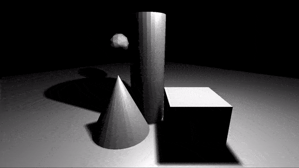
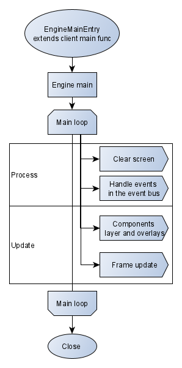

> Nibble

Everything starts from small and evolve to something big.
The project mirrors my passion to learn computer graphics, C++, and art with programming. More like demoscene making or "games" maybe.

The current goal of this project to create a flexible and comfortable demo scene engine
to make screenshots and small gifs, as I did previously done: *[Instagram nibble_hex](https://www.instagram.com/nibble_hex/)* ^_^

And yes maybe it's sort of overengineered but I'm aiming to play around with different graphical API's and platforms in the end.

---

## First version - render result and functionality


Implemented with C++, OpenGL and with other libraries GLEW, GLFW, GLM, Assimp.3.0 - [Old project branch](https://github.com/LinMAD/Nibble/tree/old_master)

#### How to build
Build system is `MSBuild`, so solution files already preconfigured you need only open it and execute solution build. 
Then you will find inside `Nibble\bin` {release/debug}-x64 prepared files.

#### Engine main loop idea


#### Singletons
- `Logger` can be accessed like `LOGGER_CLIENT_INFO("msg")`
- `EventBus` just to add event use `EVENT_BUS_ADD_EVENT(Event)`
- `Engine` allows to have one instance

#### External libraryies
Dependencies are forked and have minor modifications to use precompiled headers.

##### Development and testing environment info
```
OS: Windows 10 Home 64-bit
CPU: Intel(R) Core(TM) i7-6700HQ CPU @ 2.60GHz (8 CPUs), ~2.6GHz
GPU 1: Intel(R) HD Graphics 530
GPU 2: NVIDIA GeForce GTX 1060
IDE: Microsoft Visual Studio Community 2019 Version 16.8
```

---

## TODO Section


### Research more about that
- Debug support system? Or it's ok with logger and breakpoints?
- Memory system layer (Like I saw in the Snowdrop from Massive entertainment)
- Entity components system layer?
- Physics system layer?
- How to write automated tests for graphics?
- What else?

### TODO LIST
- Add missing features of old version:
	- Shadows Maps
	- Omni-directional Shadows
	- Directional light
	- Spotlights
	- Point lights
	- Mesh renderers
	- Materials
	- Model importing from .obj
- Files (I/O), VFS (Virtual file system) support
- Engine input handlers like Arx libertatis has
- Move Visual studio `Preprocessor definitions` to `platform.h` and refactor `MacroPlatform.h`

---

