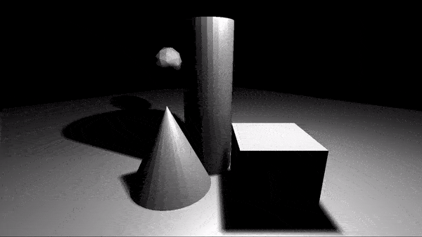

> Nibble

Everything starts from small and evolve to something big.
The project mirrors my passion to learn computer graphics, C++, and art with programming. More like demoscene making or "games" maybe.

* Let's see how far I can go with hobby \ pet project :D
---

## Past result showcase

Implemented with C++, OpenGL and with other libraries GLEW, GLFW, GLM, Assimp.3.0 - [Old project branch](https://github.com/LinMAD/Nibble/tree/old_master)
- Shadows Maps
- Omni-directional Shadows
- Directional light
- Spotlights
- Point lights
- Mesh renderers
- Materials
- Model importing from .obj

BTW, I have Instagram related to this hobby *[nibble_hex](https://www.instagram.com/nibble_hex/)* ^_^

### Development work environment info
* Window 10 x64
* NuGet for package management
* Microsoft Visual Studio Community 2019 (Solution contains linking, build events, and rest configuration)

## License
Project under MIT, so I don't mind if someone will use this code for any purpose. 
Because it's fair enough, during researches and implementation I looking for manuals, books and other projects to solve my problems.

## Brainstorm and ...

### Research more about that
- Debug support system? Or it's ok with logger and break points?
- Memory system layer (Like I saw in the Snowdrop from Massive entertainment)
- Entity components system layer?
- Physics system layer?
- Build system, do I need it?
- Scene managment (Better with UI but for now component will work)?
- What about automated code linters?
- How to write an automated tests for graphics?
- What else?

### TODO List for refactoring to have a flexible and clean work base (Not final)
Research and refactor old codebase to have a nice structure like that list:
- ~~Entry point~~
- ~~Logger~~
- Event bus system for user I/O
- Files (I/O), VFS (Virutal file system) support
- Graphic related layers
	- Applicaiton layer
		- User input
		- Events
	- Graphic renderer layer
		- API Abstraction for (OpenGL, Vulcan or DirectX)
		- Shaders compilation
